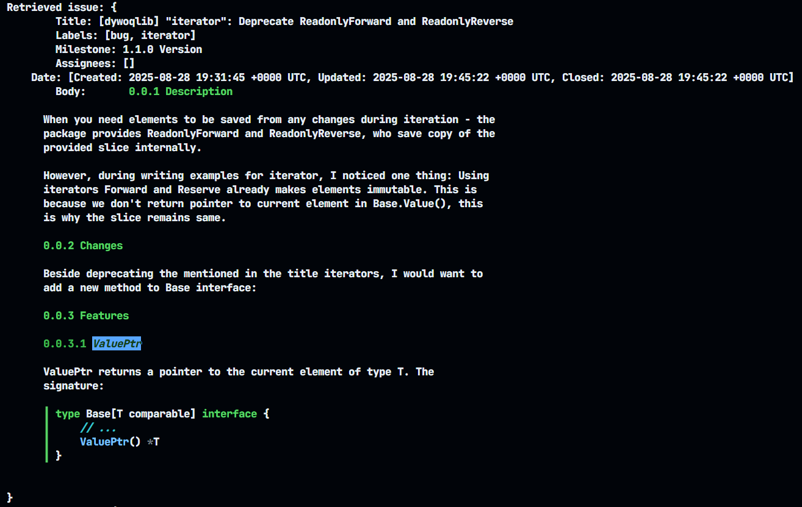
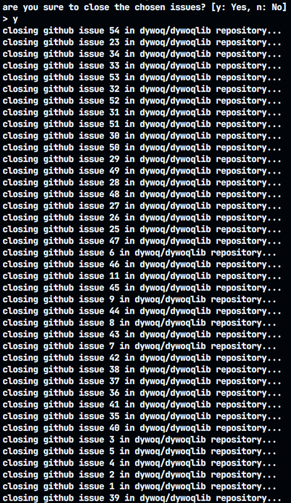

# dywoq/gh-issue

gh-issue is a tool written in Go, allowing you to mange GitHub repository issues.

## Features
- Closing issues.
- Outputting issues with their body in Markdown style, milestone, labels, title and assignees.

## Usage

To use it, you need to install it:
```
go install github.com/dywoq/gh-issue@latest
```

### Outputting
If you want to output all issues of your repository, you use:
```go
gh-issue get * <your-nickname> <your-repository> <your-token>
```

It would output like this:



### Closing
If you want to close all issue in your repository, you use:
```
gh-issue close * <your-nickname> <your-repository> <your-token>
```

It would output like this:


